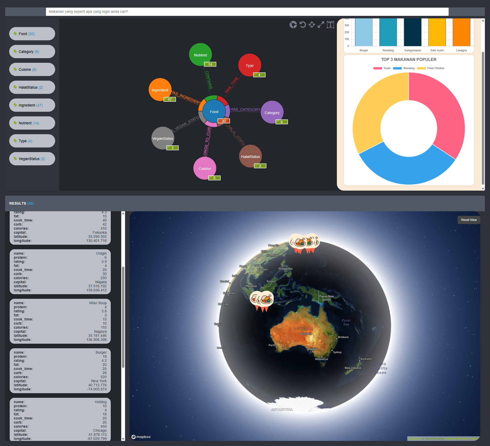

# Visualisasi Data Makanan Berbasis Knowledge Graph Menggunakan Popoto.js dan Chart.js

## 📌 Judul Proyek

**Visualisasi Data Makanan Berbasis Knowledge Graph Menggunakan Popoto.js dan Chart.js**

## 👥 Anggota Kelompok

* Muhammad Dani Nasution (223510290)
* Reza Ibnu Hanifa (223510059)
* Fauzan Difa Safli (223510556)
* Agung Setiawan (223510667)
* Ikhsan Nur Fadlie (223510094)

## 🛠 Tools yang Digunakan

* **Neo4j** – Database berbasis graph untuk menyimpan data makanan dan relasinya
* **Popoto.js** – Library JavaScript untuk visualisasi dan eksplorasi graph secara interaktif
* **Chart.js** – Library charting untuk menyajikan data statistik berbentuk grafik

## ⚙️ Fitur Popoto.js yang Digunakan

* **Auto-Complete** – Mempermudah pencarian node dengan saran otomatis
* **Factual** – Menyediakan antarmuka visual berbasis fakta dari graph
* **Taxonomy** – Menampilkan struktur kategori node yang terhubung

## 📊 Fitur Chart.js yang Digunakan

* **Bar Plot** – Menampilkan perbandingan nilai kategori makanan
* **Pie Chart** – Menunjukkan distribusi proporsi (misalnya kalori, jenis makanan)

## 📁 Dataset

* Dataset makanan berasal dari buatan sendiri. [19 fitur & 31 Baris]
* Jumlah node: 8
* Jumlah relasi: 7   

## 💻 Cara Menjalankan Proyek

1. Jalankan Neo4j dan import dataset ke dalamnya
2. Buka `index.html` di browser
3. Pastikan koneksi ke Neo4j sudah diatur di `koneksi.js`
4. Interaksikan dengan node di visualisasi Popoto dan lihat statistik di Chart.js

## 📷 Contoh Tampilan

  
*Visualisasi graph interaktif dan grafik statistik dari data makanan.*

## 💡 Tujuan Proyek

Memberikan antarmuka visual yang **mudah dieksplorasi dan informatif** terhadap data makanan menggunakan pendekatan **Knowledge Graph**, serta **menyediakan insight statistik** melalui grafik.

## 📌 Catatan Tambahan

* Proyek ini bersifat edukatif.
* Cocok untuk pemula yang ingin belajar visualisasi graph dan statistik dengan JavaScript.
